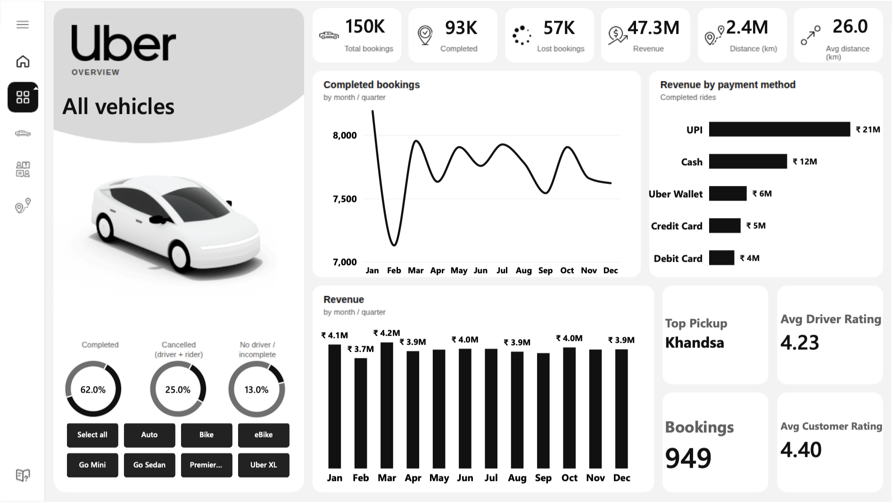
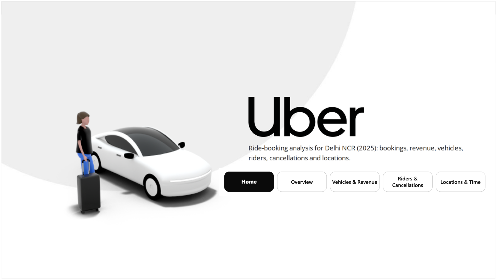
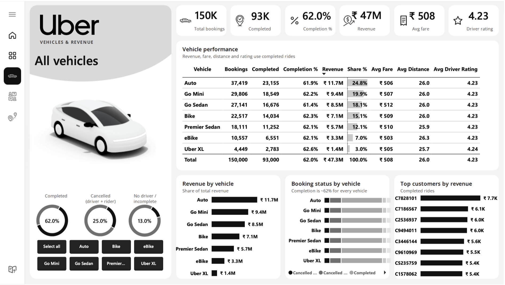
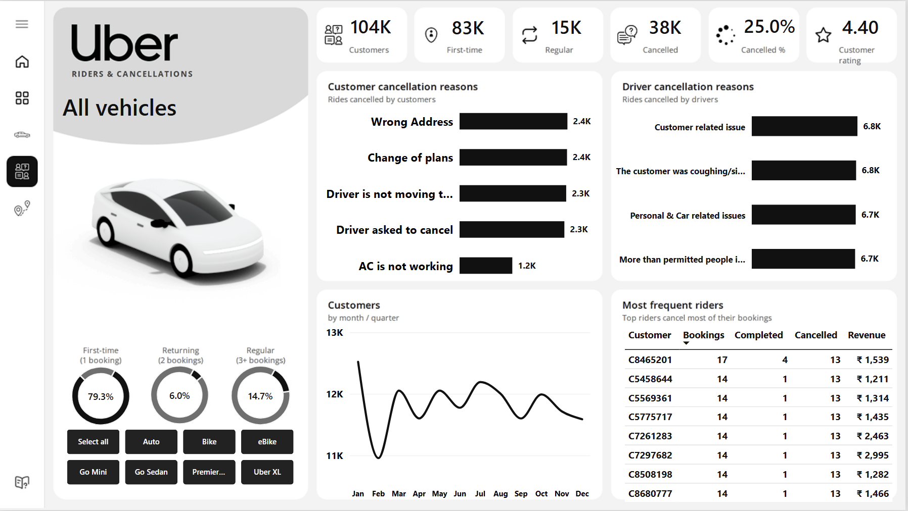
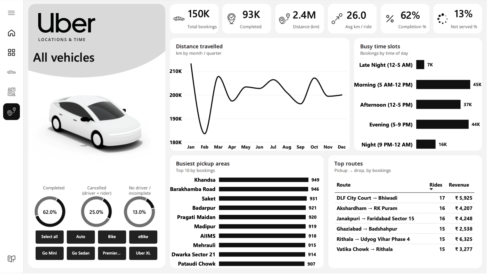

# 🚖 Uber Ride Analytics Dashboard | Power BI


An interactive 5-page Power BI report analysing **150,000 ride bookings across Delhi NCR (Jan–Dec 2025)**. It covers booking performance, revenue, vehicle types, rider behaviour, cancellations, busy hours and top locations.



---

## 📌 Business Problem

A ride-hailing operator wants one place to answer:

1. How many ride requests turn into completed trips, and where do the rest go?
2. Which vehicle types drive revenue, and do some types complete more reliably than others?
3. Who are our customers? How many come back, and why do rides get cancelled?
4. When and where is demand highest (time slots, pickup areas, routes)?

---

## 🗂️ Report Pages

| Page | What it answers |
|---|---|
| **Home** | Landing page with navigation to every section |
| **Overview** | Headline KPIs, monthly bookings & revenue, payment mix, top locations, ratings |
| **Vehicles & Revenue** | Vehicle performance table, revenue share, booking status by vehicle, top customers |
| **Riders & Cancellations** | First-time vs returning vs regular riders, customer & driver cancellation reasons, most frequent riders |
| **Locations & Time** | Distance trend, busy time slots, busiest pickup areas, top routes |

| Home | Vehicles & Revenue |
|---|---|
|  |  |
| **Riders & Cancellations** | **Locations & Time** |
|  |  |

**Interactive features**
- 🚗 **Vehicle slicer synced across all pages.** The vehicle picture, name, KPIs, rings and charts update together.
- 🎯 **Page-specific KPI row** on every page (6 KPIs tailored to that page's topic).
- 🧭 **Page navigation** from the Home page buttons.
- 📅 **Month ↔ Quarter drill** on the time-trend charts.
- 🔒 **Comparison visuals stay unfiltered** (via Edit Interactions), so all 7 vehicles remain visible while the KPIs follow the selection.

---

## 📊 Key KPIs (All vehicles)

| Total Bookings | Completed | Lost Bookings | Revenue | Avg Fare | Avg Distance | Driver ★ | Customer ★ |
|---|---|---|---|---|---|---|---|
| 150,000 | 93,000 (62%) | 57,000 (38%) | ₹47.26M | ₹508 | 26.0 km | 4.23 | 4.40 |

---

## 💡 Key Insights

- **38% of ride requests never become a trip.** Drivers cancel **18%** of all bookings (27K), the single biggest leak. Customer cancellations (7%), "No driver found" (7%) and incomplete rides (6%) make up the rest.
- **Driver cancellation reasons are evenly split** (~6.7K each across 4 reasons). There's no single fixable cause, which points to driver supply and policy.
- **Completion is ~62% for every vehicle type.** Vehicles differ in **volume, not reliability**.
- **Auto + Go Mini bring in 45% of revenue** (₹11.7M + ₹9.4M). Uber XL contributes just 3%.
- **UPI carries 45% of revenue; cash is still ~25%.**
- **Evening (5–9 PM) is the busiest window:** 44K bookings in just 4 hours, versus 45K across the 7-hour morning slot.
- **79% of customers book only once.** Retention is the biggest growth lever.
- **The most frequent riders cancel the most:** the top riders cancelled 13 of their 14–17 bookings.
- **Demand is spread evenly across the city.** The top 10 pickup areas are within 907–949 bookings of each other. The top route is DLF City Court → Bhiwadi.

## ✅ Recommendations

1. **Cut driver-side cancellations:** acceptance incentives, cancellation penalties, and better ride-matching (largest single impact on lost revenue).
2. **Add evening driver supply (5–9 PM)** with peak incentives, to reduce "No driver found".
3. **Run a first-ride → second-ride retention offer**, since 4 in 5 customers never return.
4. **Flag high-cancellation riders** (e.g., 10+ cancellations) for review or prepayment.

---

## 🧱 Data Model

- **Bookings** (fact, 150K rows): 22 columns incl. status, vehicle, locations, fare, distance, ratings, payment, plus derived *Hour*, *Time Slot*, *Route*
- **Vehicles** (dimension): vehicle type + image URL (drives the dynamic vehicle picture)
- **Calendar** (DAX date table, marked as date table): Month, Quarter, Weekday with sort columns
- **_Measures:** 35 DAX measures in a dedicated measures table

Relationships: `Vehicles 1 → * Bookings`, `Calendar 1 → * Bookings` (single direction)

### Data preparation (Power Query)
- Fixed data types (Time column, reason columns misdetected as numbers)
- Added `Hour`, `Time Slot` and `Slot Order` columns for time-of-day analysis
- Added a missing **eBike** row to the Vehicles table
- Kept blank fare/distance/rating values for cancelled rides as blanks (not 0), so averages stay correct
- Did **not** remove duplicate Booking IDs: 1,233 IDs are reused across genuinely different bookings

---

## 🧮 DAX Highlights

```DAX
Revenue = CALCULATE(SUM(Bookings[Booking Value]), Bookings[Booking Status] = "Completed")

Completion % = DIVIDE([Completed Bookings], [Total Bookings])

Revenue Share % =
DIVIDE([Revenue], CALCULATE([Revenue], REMOVEFILTERS(Vehicles), REMOVEFILTERS(Bookings[Vehicle Type])))

-- Customer segmentation by booking frequency
Regular Customers =
COUNTROWS(FILTER(VALUES(Bookings[Customer ID]), CALCULATE([Total Bookings]) >= 3))

-- Dynamic vehicle image that follows the slicer
Vehicle image =
VAR v = SELECTEDVALUE(Bookings[Vehicle Type])
RETURN IF(ISBLANK(v), "<default image URL>", LOOKUPVALUE(Vehicles[Img], Vehicles[Vehicle Type], v))

-- Most common pickup point for the current filter
Top Pickup =
MAXX(TOPN(1, VALUES(Bookings[Pickup Location]), [Total Bookings], DESC), Bookings[Pickup Location])

-- Tie-breaker so "Top 8 riders" returns exactly 8 rows (148 riders are tied at 14 bookings)
Rider Rank Score =
[Total Bookings] * 1000000 + [Cancelled Bookings] * 1000 + DIVIDE([Revenue], 10000)
```

---

## 🔍 Data Quality Notes

- The dataset is **synthetic** (Uber-style, Delhi NCR). Fare shows no relationship with distance (correlation ≈ 0.006), and averages are almost identical across vehicle types. The insights therefore focus on volume, status and behaviour patterns rather than pricing.
- **1,233 Booking IDs are reused** across different bookings. A distinct count would undercount completed trips (92,551 instead of 93,000), so bookings are counted by rows.
- The original tutorial dashboard this project started from had several issues (total distance labelled as average, rating counts shown instead of averages, eBike missing). These were corrected here.

---

## 🛠️ Tools

**Power BI Desktop** · **Power Query** · **DAX** · Excel (source data)

## 📁 Repository Files

| File | Description |
|---|---|
| `Uber-Ride-Analytics.pbix` | Power BI report file |
| `Uber-Ride-Analytics.pdf` | PDF export of all pages |
| `uber.xlsx` | Source dataset |
| `Business_Requirements.docx` | Original problem statement and KPI requirements |
| `images/` | Page screenshots |

**To open:** download the `.pbix` and `uber.xlsx`, open the report in Power BI Desktop, then go to **Transform data → Data source settings → Change Source** and point it to your local copy of `uber.xlsx`.

---

## 🙏 Credits

- Project idea and dataset adapted from a YouTube Power BI tutorial; the design, data model, measures and analysis were reworked and extended.
- Uber logo and vehicle images © Uber, used for non-commercial learning purposes only.
- Icons: Flaticon-style line icons.

---

**Author:** Jaivardhan Ranawat · [GitHub](https://github.com/Jaivardhanr28-Data) · [LinkedIn](https://www.linkedin.com/in/jaivardhan-ranawat-672884312)
